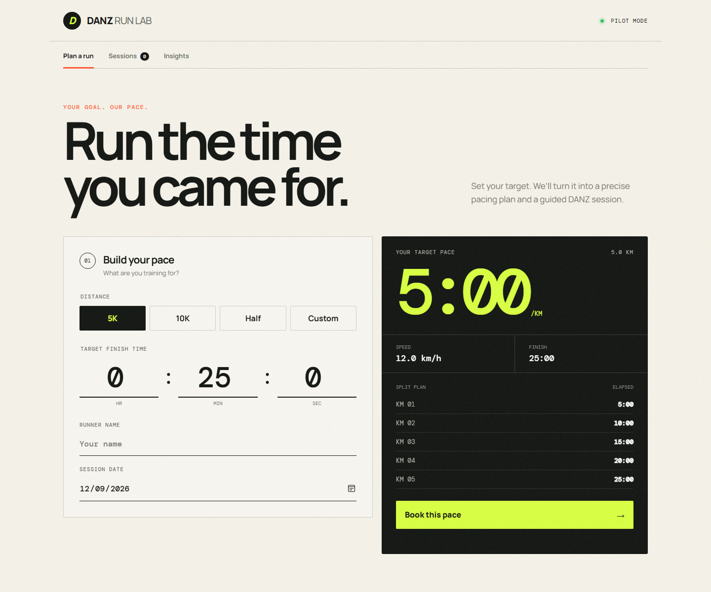

# DANZ Run Lab

DANZ Run Lab is a lightweight running pace planner. Choose a distance and target finish time to generate a precise target pace, speed, and kilometre-by-kilometre split plan.



## Features

- Preset 5K, 10K, and half-marathon distances
- Custom distances from 0.4 km to 100 km
- Live pace, speed, finish-time, and split calculations
- Saved session list
- On-device demand insights
- Responsive desktop and mobile design

## Run locally

Open `index.html` directly in a browser, or serve the folder with any static file server:

```bash
python3 -m http.server 8000
```

Then visit <http://localhost:8000>.

## Privacy

Session data is stored only in the browser's local storage. No information leaves the device.

## Technology

The app is dependency-free and built with HTML, CSS, and vanilla JavaScript.
