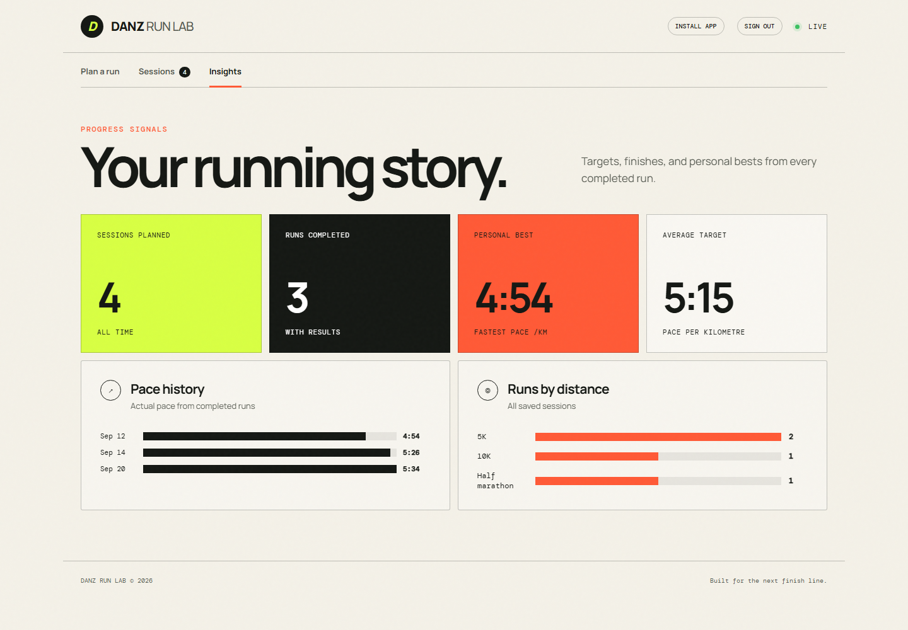

# DANZ Run Lab

DANZ Run Lab is a lightweight running pace planner and progress tracker. Choose a distance and target finish time to generate a precise target pace, speed, and kilometre-by-kilometre split plan.



## Features

- Preset 5K, 10K, and half-marathon distances
- Custom distances from 0.4 km to 100 km
- Live pace, speed, finish-time, and split calculations
- Editable and reusable saved sessions
- Actual results compared with target times
- Pace history and personal-best tracking
- Supabase cloud submission and synchronization
- Magic-link admin authentication
- Admin-only Sessions and Insights
- Shareable pace-plan links
- CSV export and JSON backup/restore
- Installable offline web app
- Responsive desktop and mobile design

## Run locally

Open `index.html` directly in a browser, or serve the folder with any static file server:

```bash
python3 -m http.server 8000
```

Then visit <http://localhost:8000>.

## Install

Open the live site in a supported browser and choose **Install app**. Once installed, the core app works offline.

## Privacy

Submitting a pace plan sends the runner name, session date, distance, and target time to the DANZ Run Lab Supabase project. Row-Level Security prevents public reads; only the configured administrator can access Sessions and Insights. Offline submissions remain on the device until they can synchronize.

## Supabase setup

1. Run [`supabase/schema.sql`](supabase/schema.sql) in the project's Supabase SQL Editor.
2. In **Authentication → URL Configuration**, set the Site URL and redirect URL to `https://stainaz.github.io/danz-run-lab/`.
3. Use `asimango@gmail.com` in the app's **Admin login** dialog.

## Technology

The frontend uses HTML, CSS, vanilla JavaScript, and Supabase.
